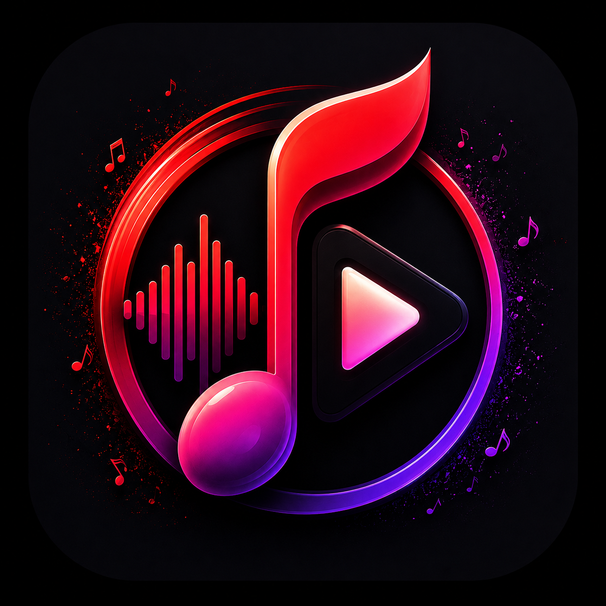
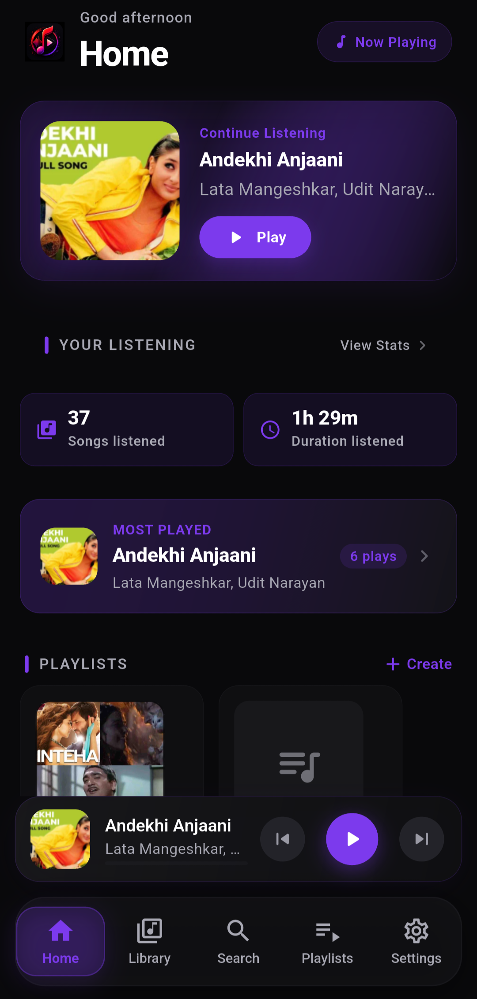
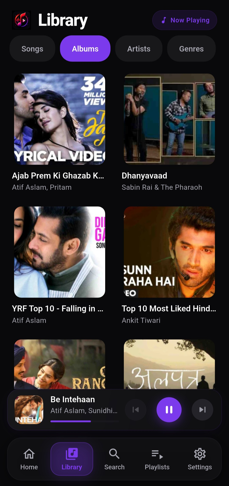
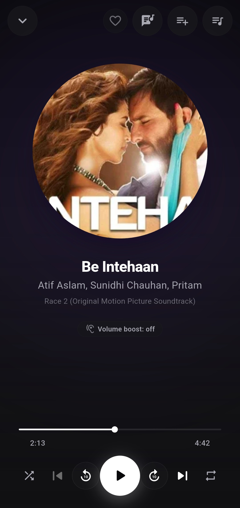
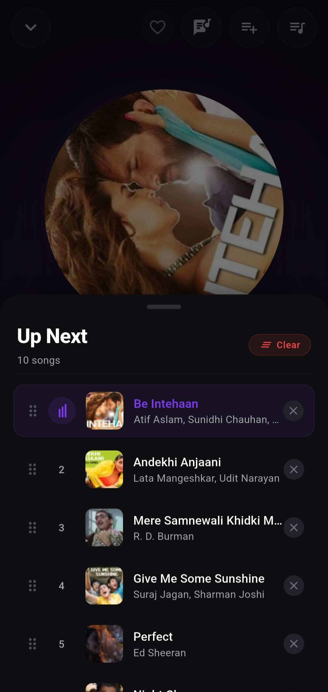
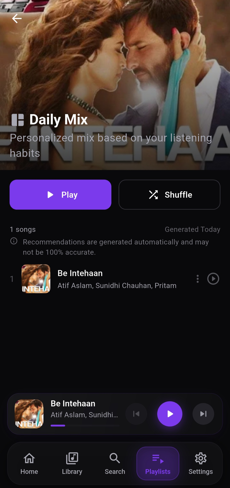
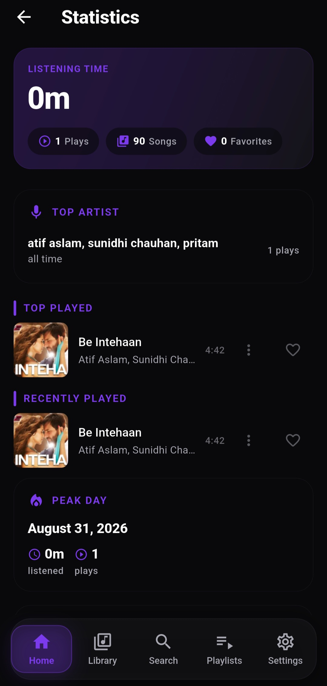
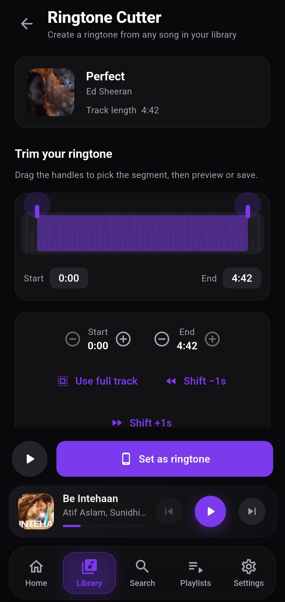

# 🎵 VoraTube

<p align="center">
  
</p>

<p align="center">
  <strong>A modern, feature-rich offline music player for Android.</strong>
</p>

<p align="center">
  Built with Flutter • Designed for smooth playback • Privacy-focused • No account required
</p>

<p align="center">


</p>

---

## ✨ About

**VoraTube** is a modern Android music player built with Flutter, focused on delivering a smooth, beautiful, and feature-rich local music experience.

It is designed around three principles:

* 🎨 **Beautiful UI** — modern, polished interfaces and animations
* ⚡ **Smooth experience** — responsive playback and navigation
* 🔒 **Local-first** — your music library and listening experience stay on your device

VoraTube does not require an account to use the core music-player experience.

---

## 📱 Screenshots

<p align="center">
  
  
  
</p>

<p align="center">
  
  
  
</p>

<p align="center">
  
</p>

---

# 🚀 Features

## 🎧 Music Playback

* Local music playback
* Play, pause and resume
* Next / previous track
* Seek through songs
* Accurate playback position
* Background playback
* Playback session restoration
* Current-song persistence
* Playback position restoration
* Automatic advancement to the next playable track
* Broken-source handling
* Playback queue support

---

## 📚 Music Library

VoraTube automatically works with your device's music library and organizes your collection into:

* Songs
* Albums
* Artists
* Genres
* Playlists

The library is designed to keep your music accessible without requiring manual import workflows.

---

## 🔎 Search

Quickly search your local music library.

Search across:

* Songs
* Artists
* Albums
* Playlists

---

## 📋 Playlists

Create and manage your own playlists.

Supported operations include:

* Create playlists
* Rename playlists
* Delete playlists
* Add songs
* Remove songs
* Reorder songs
* Play all
* Shuffle
* Play next
* Queue management

---

## 🎶 Queue

A complete playback queue system lets you control exactly what plays next.

Features include:

* Add to queue
* Play next
* Play all
* Remove songs
* Reorder queue items
* Queue persistence
* Queue/session restoration
* Current-track synchronization

---

## 🧠 Smart Music

VoraTube includes intelligent music organization and recommendation features.

### Smart Mix

Generate a dynamic listening mix based on your library and listening data.

### Smart Mood

Discover music based on mood-oriented recommendations.

### Genre Suggestions

VoraTube can suggest genres using its existing genre-enrichment system and allows you to select from the generated genre options.

---

## 📊 Listening Statistics

Track your listening activity directly inside the app.

Statistics include:

* Listening time
* Play counts
* Top songs
* Recently played songs
* Daily listening
* Weekly listening
* Yearly listening
* Listening graphs
* Playback history

The statistics system is designed around actual playback activity rather than manually entered data.

---

## 🎤 Lyrics

VoraTube includes an integrated lyrics experience.

Features include:

* Lyrics panel
* Animated lyrics interface
* Per-song lyrics
* Lyrics synchronization
* Time-based lyric progression
* Full-player lyrics experience

---

## 🎚️ Audio Controls

VoraTube provides additional audio controls for users who want more control over playback.

### Preamp

Adjust the preamp level to control the audio signal before playback processing.

### ReplayGain

Support for ReplayGain-based volume normalization.

---

## 🎼 Metadata

Manage your music metadata directly from the application.

Edit:

* Title
* Artist
* Album
* Genre
* Year

VoraTube also provides genre suggestion functionality to help categorize songs.

---

## 📳 MiniPlayer

A persistent MiniPlayer provides quick access to the current track.

Features include:

* Current artwork
* Song information
* Play/pause
* Seek
* Horizontal scrubbing
* Vertical swipe gestures
* Open Full Player
* Stop playback
* Persistent playback state

---

## 🎵 Full Player

A dedicated full-screen player provides an immersive listening experience.

Includes:

* Large artwork
* Playback controls
* Seek bar
* Current position
* Duration
* Lyrics
* Lyrics synchronization
* Favorite controls
* Audio controls
* Queue interaction

---

## 🔔 Background Playback & Media Controls

VoraTube continues playback while the application is in the background.

Android media controls provide access to:

* Play/pause
* Previous
* Next
* Current song
* Artist
* Artwork
* Playback state

This integrates with Android's media-session system for a native playback experience.

---

## 🔒 Lock Screen Controls

When music is playing, Android's lock screen can display the current media session.

Supported information includes:

* Song title
* Artist
* Artwork
* Playback state
* Previous
* Play/pause
* Next

---

## 📱 Android Notification

VoraTube provides an Android media notification while playback is active.

The notification updates as songs change and provides playback controls without requiring the application to be opened.

---

## 📳 Ringtone Cutter

Create ringtones from songs in your library.

Features include:

* Select a section of a song
* Preview the selected section
* Export ringtone
* Save the resulting ringtone
* Android ringtone integration

Exported ringtones are handled separately from the normal music library.

---

## 🏷️ Edit Tags

Edit song metadata directly from the application without requiring an external tag editor.

Supported metadata includes:

* Title
* Artist
* Album
* Genre
* Year

---

## 💾 Storage Information

The Settings screen provides storage information from the Android device.

It can display:

* Total storage
* Used storage
* Available storage
* VoraTube app usage

---

## ⚙️ Settings

VoraTube includes a dedicated settings area for configuring the listening experience.

Available controls include:

* Theme
* Audio settings
* Preamp
* ReplayGain
* Storage information
* App usage

---

# 🎨 Design

VoraTube uses a dark, modern visual language with a distinctive purple-themed identity.

The UI focuses on:

* Smooth animations
* Clear hierarchy
* Large artwork
* Responsive interactions
* Modern cards
* Bottom navigation
* Bottom sheets
* Full-screen playback
* Consistent visual components

The goal is to make a powerful music player feel simple and enjoyable to use.

---

# 🛠️ Tech Stack

VoraTube is built using the Flutter ecosystem.

| Technology               | Usage                                 |
| ------------------------ | ------------------------------------- |
| **Flutter**              | Application framework                 |
| **Dart**                 | Programming language                  |
| **Riverpod**             | State management                      |
| **just_audio**           | Audio playback                        |
| **audio_service**        | Background playback & media controls  |
| **Android MediaSession** | Lock-screen and notification controls |
| **Android MediaStore**   | Local music library                   |
| **Flutter plugins**      | Android platform integrations         |

---

# 🏗️ Architecture

VoraTube follows a modular Flutter architecture designed to keep features separated and maintainable.

Major areas include:

```text
lib/
├── app/
├── core/
├── features/
│   ├── library/
│   ├── player/
│   ├── playlists/
│   ├── search/
│   ├── settings/
│   ├── statistics/
│   ├── lyrics/
│   ├── ringtone/
│   └── smart_music/
├── shared/
└── main.dart
```

The exact project structure may evolve as development continues.

---

# 📋 Requirements

For development you will need:

* Flutter SDK
* Dart SDK
* Android Studio
* Android SDK
* Android device or emulator

Recommended:

```text
Flutter 3.47.1
Dart 3.13.1
```

VoraTube currently targets Android.

---

# 🧑‍💻 Getting Started

Clone the repository:

```bash
git clone https://github.com/piyush-baniya/VoraTube.git
```

Enter the project:

```bash
cd VoraTube
```

Install dependencies:

```bash
flutter pub get
```

Check your Flutter environment:

```bash
flutter doctor
```

Connect an Android device and run:

```bash
flutter devices
```

Then:

```bash
flutter run
```

---

# 🔨 Build

### Debug APK

```bash
flutter build apk --debug
```

### Release APK

```bash
flutter build apk --release
```

The release APK will be generated under:

```text
build/app/outputs/flutter-apk/
```

> Release builds require a properly configured Android signing key. Never commit your keystore or signing credentials to the repository.

---

# 🧪 Testing

Run static analysis:

```bash
flutter analyze
```

Run tests:

```bash
flutter test
```

Format the project:

```bash
dart format .
```

---

# 📱 Supported Platform

### Android

VoraTube is currently developed for Android.

### iOS

iOS support is not currently released.

The project is currently focused on delivering the Android experience first.

---

# 🗺️ Roadmap

VoraTube is actively evolving.

Potential future improvements include:

* More advanced audio processing
* More personalization
* Additional statistics
* More powerful playlist tools
* UI/animation improvements
* Additional Android integrations
* Expanded platform support

The roadmap may change as development continues.

---

# 🤝 Contributing

Contributions, suggestions, bug reports, and feature ideas are welcome.

Before making large changes:

1. Open an issue describing the problem or feature.
2. Discuss the proposed approach.
3. Make the changes in a separate branch.
4. Test the changes.
5. Open a pull request.

For bugs, please include:

* Android version
* Device model
* VoraTube version
* Steps to reproduce
* Expected behavior
* Actual behavior
* Relevant logs or screenshots

---

# 🐛 Bug Reports

If you encounter a problem, please open an issue in the repository.

Include enough information to reproduce the issue so it can be investigated efficiently.

---

# 📄 License

License information will be added to this repository.

---

# 💜 VoraTube

Built with Flutter and a lot of attention to the music-listening experience.

**Listen. Discover. Organize. Enjoy.**

<p align="center">
  Made with 💜 for music lovers.
</p>
